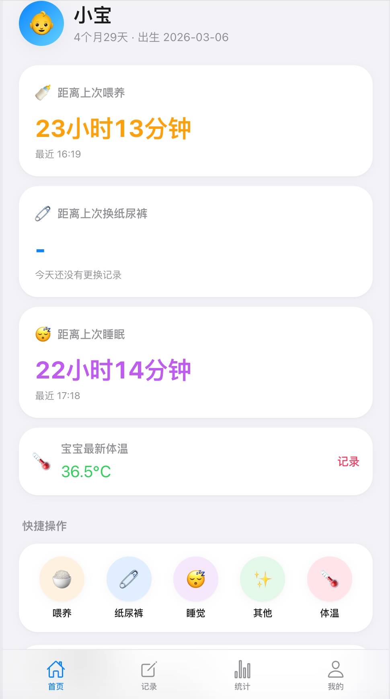
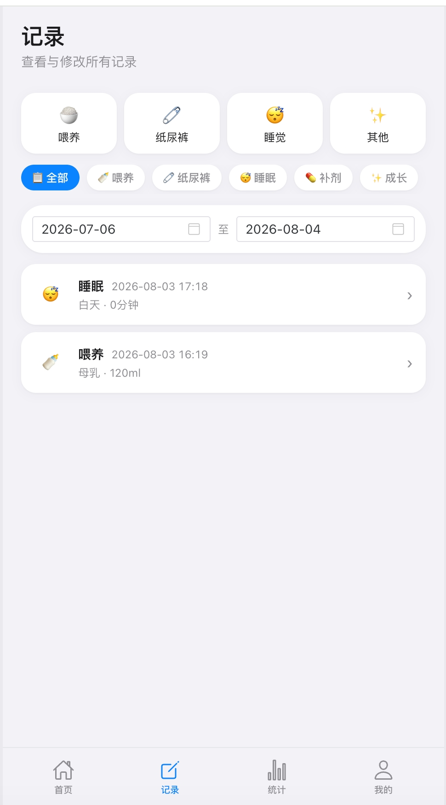
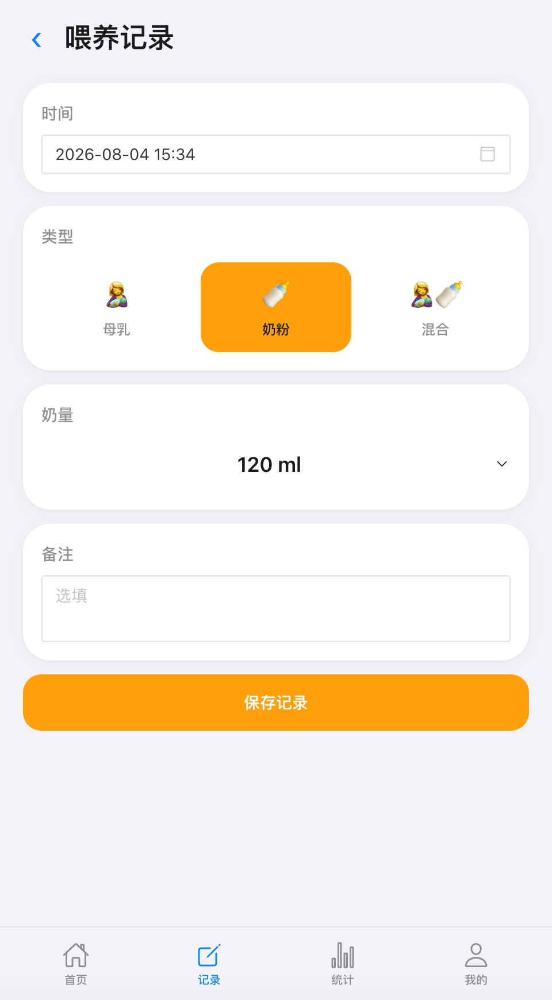
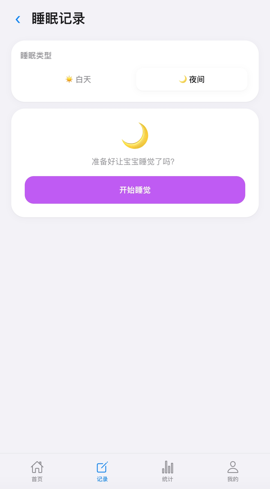
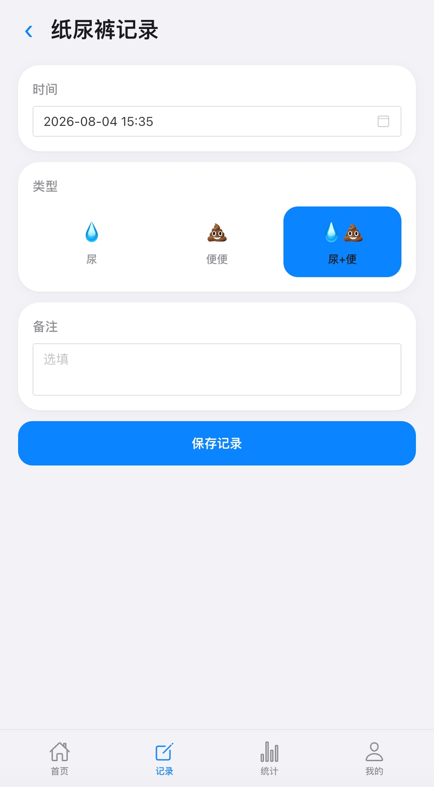
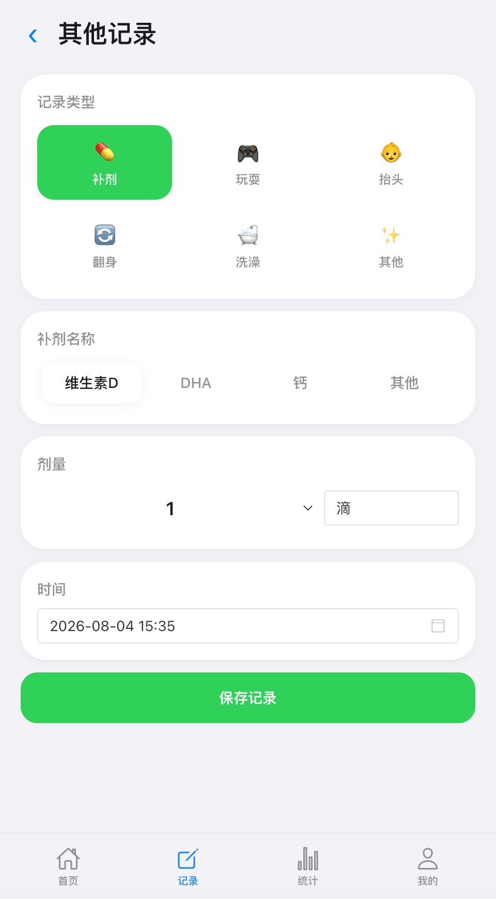
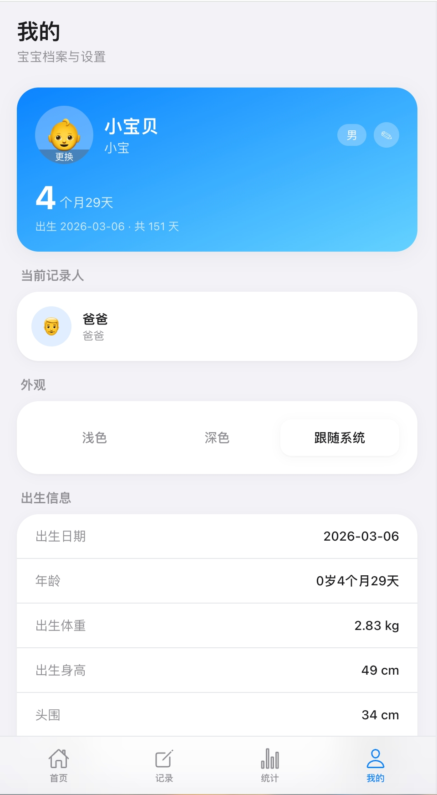
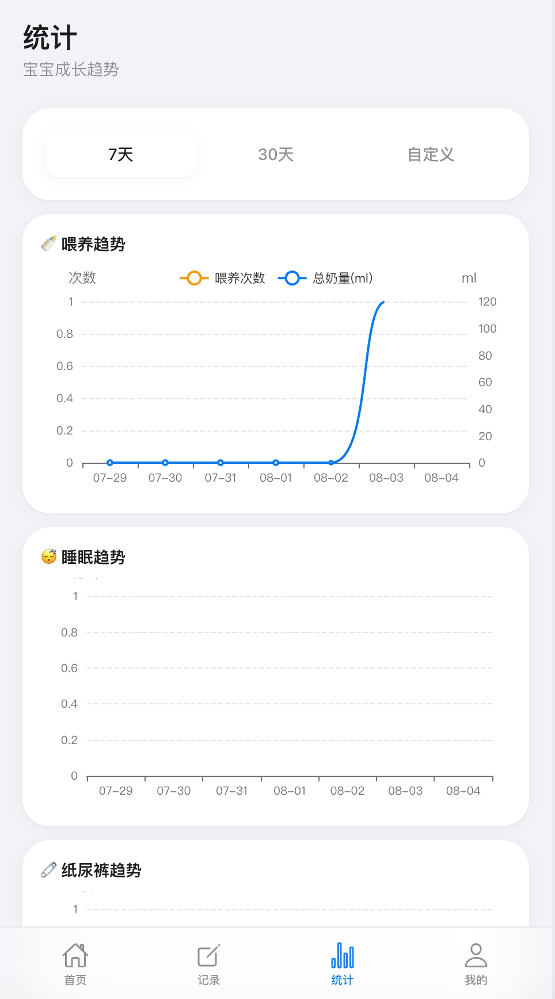

# 宝宝成长记录系统

> 家庭内部使用的宝宝成长记录系统：记录宝宝每天的喂养、睡眠、换尿布、补剂、体温、活动事件，提供查询、统计分析与数据可视化，并为未来 AI 分析预留数据底座。

基于 pnpm monorepo 架构：**NestJS 后端 + Vue3 前端 + 共享类型包**，支持一键 Docker 部署（单镜像内置 nginx + Node + 可选 PostgreSQL）。

---

## 目录

- [功能特性](#功能特性)
- [界面预览](#界面预览)
- [技术栈](#技术栈)
- [项目结构](#项目结构)
- [快速开始](#快速开始)
  - [方式一：Docker 一键部署](#方式一docker-一键部署推荐)
  - [方式二：本地开发](#方式二本地开发)
- [环境变量](#环境变量)
- [API 文档](#api-文档)
- [数据库设计](#数据库设计)
- [相关文档](#相关文档)

---

## 功能特性

- 👶 **多宝宝 / 多记录人**：所有记录挂 `baby_id` 与 `creator_id`，支持多宝宝、多家庭成员（爸爸/妈妈/爷爷奶奶/姥姥姥爷）协同记录。
- 📝 **六大记录域**：喂养、睡眠、换尿布、补剂、体温、活动事件；睡眠支持「开始/结束」快捷计时录入。
- 📊 **统计与可视化**：按日 / 7 天 / 30 天 / 自定义区间聚合统计，前端基于 ECharts 呈现趋势图与仪表盘。
- 🧩 **领域驱动模块化**：每个业务域自成 NestJS 模块，统计 / 仪表盘 / 间隔分析作为只读聚合层复用底层事件。
- 🗄️ **原始事件优先**：保留完整原始事件（不丢弃字段、不只存聚合结果），为生长曲线与 AI 分析留足数据底座。
- 🛡️ **统一契约**：统一响应格式 `{ code, message, data }`、统一异常处理、全局 DTO 校验、Swagger 自动文档。
- 🔐 **访问认证**：部署密码由环境变量注入，服务端签发带有效期的 HttpOnly Cookie，业务 API 默认全部受保护。
- 💤 **智能哄睡提醒**：按宝宝月龄和最近醒来时间实时显示正常清醒、进入哄睡窗口或清醒过久状态。
- 🐳 **一键部署**：多阶段构建的单镜像，内置 nginx 反代 + Node 运行时，自动建表与种子数据。

---

## 界面预览

> 以下为系统主要界面截图，左右滑动可查看全部页面。每张截图统一宽度并保持原始宽高比，避免图片过大导致页面过长。

<table>
  <tr>
    <td align="center"><br><sub>主页（仪表盘）</sub></td>
    <td align="center"><br><sub>记录页面</sub></td>
    <td align="center"><br><sub>喂养详情页</sub></td>
    <td align="center"><br><sub>睡眠记录</sub></td>
    <td align="center"><br><sub>纸尿裤更换</sub></td>
    <td align="center"><br><sub>其他记录</sub></td>
    <td align="center"><br><sub>宝贝信息页面</sub></td>
    <td align="center"><br><sub>成长统计</sub></td>
  </tr>
</table>

## 技术栈

| 层 | 选型 |
|---|---|
| 语言 | TypeScript 5 |
| 后端框架 | NestJS 11 |
| ORM | Prisma 5 |
| 数据库 | PostgreSQL 15+ |
| 前端框架 | Vue 3 + Vite 6 |
| UI 组件库 | Naive UI |
| 状态管理 | Pinia |
| 图表 | ECharts + vue-echarts |
| 样式 | TailwindCSS 3 |
| API 文档 | Swagger / OpenAPI |
| 包管理 | pnpm 11 workspace |
| 部署 | Docker + docker-compose |

## 项目结构

```
baby-record-system
├── apps
│   ├── backend              NestJS 后端
│   │   ├── src
│   │   │   ├── modules      业务模块（baby/user/feeding/diaper/sleep/...）
│   │   │   ├── common       横切关注点（filters/interceptors/pipes/...）
│   │   │   ├── config       配置（@nestjs/config + Joi）
│   │   │   └── prisma       PrismaService + 种子数据
│   │   └── prisma/schema.prisma
│   └── frontend             Vue3 前端
│       └── src
│           ├── views         页面（dashboard/record/history/statistics/...）
│           ├── components    复用组件
│           ├── api           接口封装
│           ├── stores        Pinia 状态
│           └── router        路由
├── packages
│   └── shared               前后端复用类型
├── docs                     设计文档 / ER 图 / API 总览 / schema.sql
├── Dockerfile               多阶段构建（前端构建 → 后端构建 → 运行时）
├── docker-compose.yml
├── nginx.conf               nginx 反代配置（SPA + /api + /docs）
├── entrypoint.sh            容器启动脚本（种子 → 后端 → nginx）
└── pnpm-workspace.yaml
```

## 快速开始

### 方式一：Docker 一键部署（推荐）

单镜像内置 nginx + Node，启动时自动执行种子数据。默认连接外部 PostgreSQL，也可启用内置 PostgreSQL。

**连接外部 PostgreSQL（默认）**：

```bash
# 修改 docker-compose.yml 中 app.environment 的 DATABASE_* 为你的数据库地址
export BABY_RECORD_PASSWORD='请替换为强密码'
docker compose up -d --build
# 访问 http://localhost:8080
```

**启用内置 PostgreSQL**（自带建表与种子数据）：

编辑 `docker-compose.yml`，取消注释 `postgres` 服务、`app.depends_on` 与 `volumes`，然后：

```bash
docker compose up -d --build
# 访问 http://localhost:8080
```

> 镜像构建过程：① 构建前端 → ② 构建后端 → ③ 运行时镜像安装生产依赖、生成 Prisma Client、复制产物，由 nginx 反代 `/api` 与 `/docs` 到后端 NestJS。

### 方式二：本地开发

前置：Node 22+、pnpm 11+、PostgreSQL 15+。

```bash
# 1. 安装全部依赖
pnpm install

# 2. 配置后端环境变量
cp apps/backend/.env.example apps/backend/.env
#   编辑 .env，填入数据库连接与 APP_PORT / API_PREFIX / SWAGGER_PATH

# 3. 数据库迁移 + 种子数据
pnpm --filter @baby-record/backend prisma:migrate
pnpm --filter @baby-record/backend prisma:seed

# 4. 启动后端（http://localhost:3000）
pnpm dev:backend

# 5. 启动前端（另开终端）
cp apps/frontend/.env.example apps/frontend/.env
pnpm dev           # 即 pnpm dev:frontend
```

常用脚本：

| 命令 | 说明 |
|---|---|
| `pnpm dev` | 启动前端（Vite） |
| `pnpm dev:backend` | 启动后端（watch 模式） |
| `pnpm build:frontend` | 构建前端 |
| `pnpm build:backend` | 构建后端 |
| `pnpm lint` | 全量 lint |
| `pnpm --filter @baby-record/backend prisma:studio` | Prisma 数据库可视化管理 |
| `pnpm --filter @baby-record/backend prisma:migrate` | 创建并应用迁移 |
| `pnpm --filter @baby-record/backend prisma:deploy` | 生产环境应用迁移 |

## 环境变量

### 后端（`apps/backend/.env`）

| 变量 | 默认 | 说明 |
|---|---|---|
| `DATABASE_HOST` / `DATABASE_PORT` / `DATABASE_NAME` / `DATABASE_USERNAME` / `DATABASE_PASSWORD` | — | 数据库连接参数（拼接为 `DATABASE_URL`） |
| `DATABASE_URL` | — | 完整连接串，填写则优先使用。密码含 `@` 需编码为 `%40` |
| `APP_PORT` | `3000` | 后端服务端口 |
| `NODE_ENV` | `development` | 运行环境 |
| `API_PREFIX` | `api/v1` | API 全局前缀 |
| `SWAGGER_PATH` | `docs` | Swagger 文档路径 |
| `BABY_RECORD_PASSWORD` | — | 必填，项目访问密码，至少 6 位；不可写入前端或提交到仓库 |
| `BABY_RECORD_AUTH_SECRET` | 默认使用访问密码派生 | 可选会话签名密钥，至少 32 位；修改后已有会话失效 |
| `BABY_RECORD_SESSION_DAYS` | `30` | 登录状态有效天数，范围 1–365 |
| `BABY_RECORD_COOKIE_SECURE` | 生产环境默认 `true` | HTTPS 部署设为 `true`；直接使用 HTTP 时设为 `false` |
| `CORS_ORIGIN` | `http://localhost:5173` | 本地前端开发源，允许携带认证 Cookie |

### 前端（`apps/frontend/.env`）

| 变量 | 说明 |
|---|---|
| `VITE_API_BASE_URL` | 后端 API 地址，开发环境指向 `http://localhost:3000/api/v1`；生产构建内置为 `/api/v1`（同源，由 nginx 反代） |

## API 文档

- 全局前缀：`/api/v1`
- 统一响应格式：成功 `{ "code": 0, "message": "success", "data": {...} }`；失败附带 `details`。
- Swagger 文档：启动后访问 `/docs`（本地开发为 `http://localhost:3000/docs`，Docker 部署为 `http://localhost:8080/docs`）。

核心模块路由（详见 [docs/api-overview.md](./docs/api-overview.md)）：

| 模块 | 路径前缀 | 说明 |
|---|---|---|
| baby | `/babies` | 宝宝增改查（含年龄/月龄/天数计算） |
| user | `/users` | 记录人身份 |
| feeding | `/feedings` | 喂养 CRUD |
| diaper | `/diapers` | 换尿裤 CRUD |
| sleep | `/sleeps` | 睡眠 CRUD + `start` / `:id/end` 计时录入 |
| supplement | `/supplements` | 补剂 CRUD |
| temperature | `/temperatures` | 体温记录 |
| activity | `/activities` | 活动事件 CRUD |
| records | `/records` | 聚合查询（`daily` / `range`） |
| statistics | `/statistics` | 区间统计（today/7d/30d/custom） |
| dashboard | `/dashboard` | 仪表盘概览 |
| chart | `/charts` | 可视化图表数据 |
| auth | `/auth/login`、`/auth/status`、`/auth/logout` | 项目访问认证（公开接口） |

## 数据库设计

共 10 张表（7 张核心表 + 3 张预留表）。所有业务表统一：主键自增、外键 `baby_id`（级联删除）、外键 `creator_id`、`created_time`，关键查询字段建复合索引 `(baby_id, 业务时间)`。

| 表 | 关键字段 |
|---|---|
| `baby` | name, nickname, gender, birthday, birth_weight, birth_height, head_circumference, avatar |
| `user` | name, role（6 种家庭角色枚举） |
| `feeding` | feeding_time, feeding_type(母乳/奶粉/混合), amount_ml, duration_minutes |
| `diaper` | change_time, type(尿/便便/尿+便) |
| `sleep` | start_time, end_time, duration_minutes, sleep_type(白天/夜间) |
| `supplement` | name, amount, unit, take_time |
| `temperature` | measure_time, temperature |
| `activity` | event_type, event_time, description |
| `growth_record`（预留） | measure_time, weight, height, head_circumference |
| `medical_record`（预留） | record_type, record_time, title |
| `ai_analysis`（预留） | analysis_type, period_start/end, input(JSON), result(JSON) |

ER 图见 [docs/er-diagram.md](./docs/er-diagram.md)，建表 SQL 见 [docs/schema.sql](./docs/schema.sql)。

## 清醒窗口与提醒规则

清醒窗口保存在 `apps/backend/src/config/wake-windows.json`，与业务计算代码分离。首页以最后一次已结束睡眠的 `endTime` 作为醒来时间：到达区间下限前显示绿色，到达下限后显示蓝色，超过区间上限显示红色；页面每 30 秒自动重算。

参考区间主要来自 [CHOC Children's Health：Babies and sleep](https://health.choc.org/babies-and-sleep-the-ultimate-guide/)；[Cleveland Clinic](https://health.clevelandclinic.org/wake-windows-by-age) 同时强调不同宝宝及同一宝宝每天的清醒窗口都可能不同，应结合打哈欠、揉眼、活动减少等困倦信号判断。此功能仅作日常参考，不能替代儿科医生建议。

### 验证方法

1. 不带 Cookie 请求 `GET /api/v1/babies`，应返回 HTTP 401。
2. 向 `POST /api/v1/auth/login` 提交错误密码，页面应显示“密码错误”；提交正确密码后应进入系统并收到 HttpOnly Cookie。
3. 刷新或关闭后重新打开浏览器，应在有效期内保持登录；在“我的”点击退出后应回到登录页。
4. 修改最近一条睡眠的结束时间，分别模拟小于推荐下限、介于上下限、超过上限，首页圆点应依次为绿色、蓝色、红色，并在不刷新页面时自动切换。

## 相关文档

- [设计方案](./docs/design.md) — 设计原则、架构、技术栈、API 设计
- [API 接口总览](./docs/api-overview.md) — 全部接口清单
- [ER 图](./docs/er-diagram.md) — 数据库实体关系
- [Swagger 使用说明](./docs/swagger-usage.md) — 文档访问与调试
- [建表 SQL](./docs/schema.sql) — PostgreSQL DDL

---

## License

MIT
