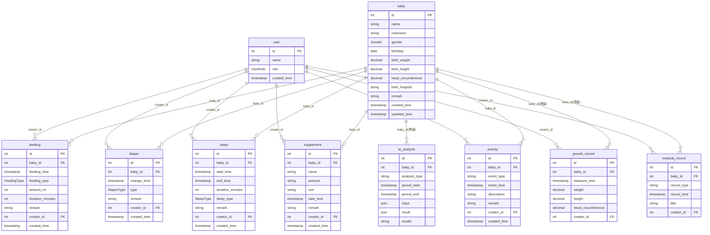

# 数据库 ER 图

## 实体关系图

## 枚举说明

| 枚举 | 值 | 说明 |
|---|---|---|
| Gender | MALE / FEMALE | 男 / 女 |
| UserRole | DAD / MOM / GRANDPA_P / GRANDMA_P / GRANDMA_M / GRANDPA_M | 爸爸/妈妈/爷爷/奶奶/姥姥/姥爷 |
| FeedingType | BREAST_MILK / FORMULA / MIXED | 母乳/奶粉/混合 |
| DiaperType | PEE / POOP / BOTH | 尿/便便/尿+便 |
| SleepType | DAYTIME / NIGHT | 白天/夜间 |

## 索引策略

每张业务表均建复合索引 `(baby_id, 业务时间)`，覆盖最高频的「按宝宝 + 时间范围」查询/统计/可视化路径；并单独建 `creator_id` 索引。
